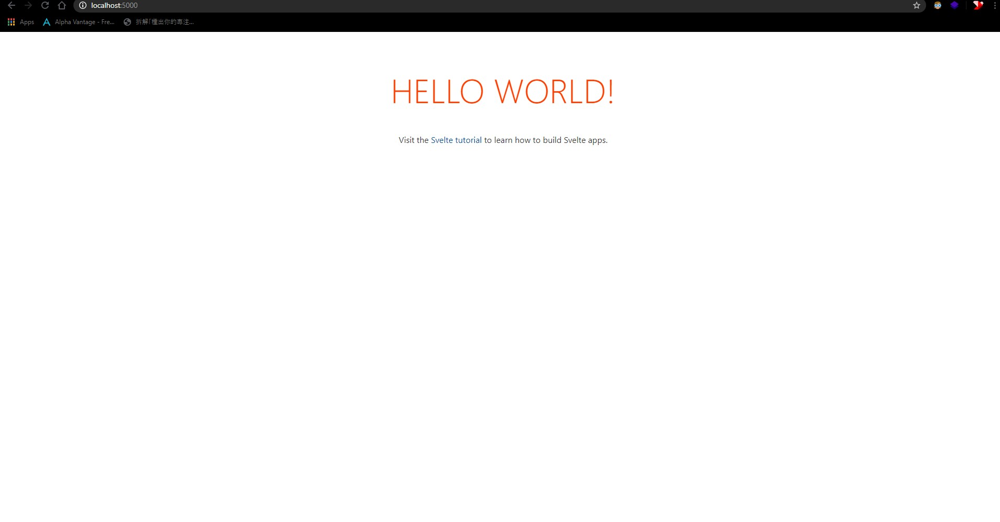

# Sveltejs quickstart

1. Download nodejs if you do not have [here](https://nodejs.org/en/)
2. Go to any empty new folder, open you terminal there
3. Run `npx degit sveltejs/template`

    3.1 if you see `! destination directory is not empty, aborting. Use --force to override`, most likely the folder is not empty, use `npx degit sveltejs/template --force` to force it download it in that folder

4. Run `npm install` to install all the dependencies
5. Run `npm run dev` to quickly start a development server!
6. Go to any browser key in `localhost:5000`
7. Whorla! You should see a page similar to this!

